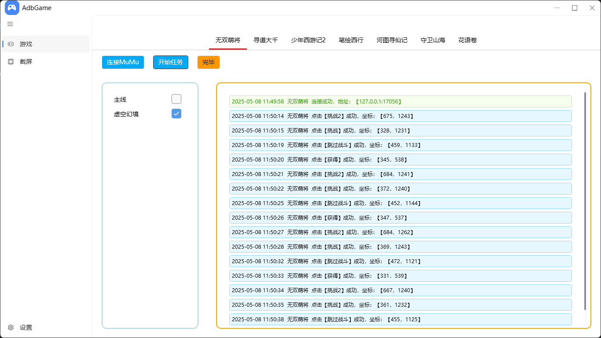
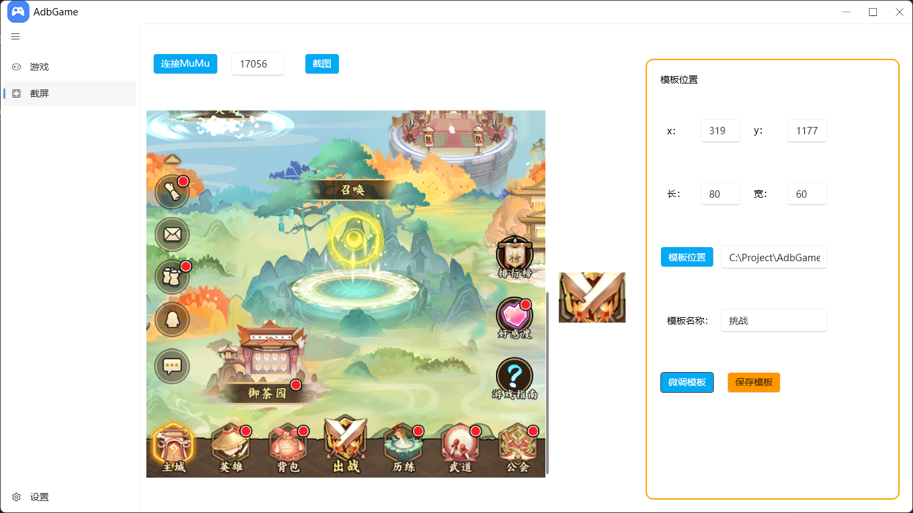
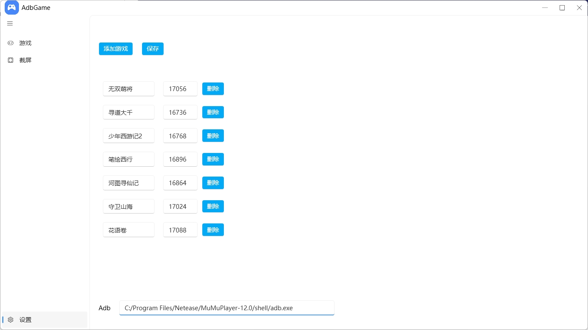

# AdbGame

## 介绍

**使用MuMu模拟器，通过Adb连接，基于图像识别技术，使用正态分布算法模拟人手点击鼠标，完成重复性的动作**

## 界面预览

## 许可证

### AdbGame

本项目采用 [`MIT`] 许可证进行开源。

## 鸣谢

### 开源库

- [opencv](https://github.com/opencv/opencv)  
  Open Source Computer Vision Library